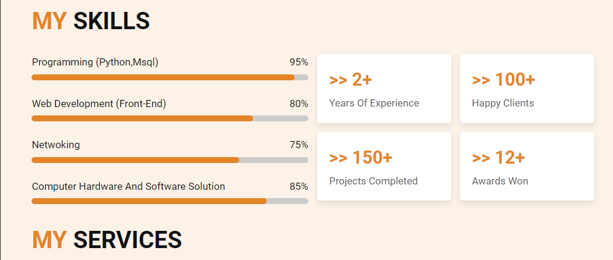

## web CV portfolio
This project is done by Brian and Isaiah
## Introduction
Here is the link to my deployed website <https://kellyinfortech.github.io/>

Brian <https://www.linkedin.com/in/kellyinfortech-solution-811269257/>
Isiah <https://www.linkedin.com/in/isaiah-nweze-9b76b3211?trk=contact-info>

blog <https://www.linkedin.com/pulse/portfolio-project-blog-post-kellyinfortech-solution-i2mmf/>

## Inspiration
My journey towards working on this portfolio project is not merely rooted in a passing interest, but rather, it is deeply intertwined with a significant transition in my life. When my team expressed their enthusiasm for creating a project centered around personal portfolios, I found myself drawn to the challenge, despite not having a personal affinity for the subject matter.

Transitioning from a career as a telecommunication and IT to pursuing software engineering was a monumental shift for me. After the factory closure left me unemployed for two years, I made the courageous decision to relocate across the country with my wife and two daughters, embarking on a journey of reinvention and self-discovery